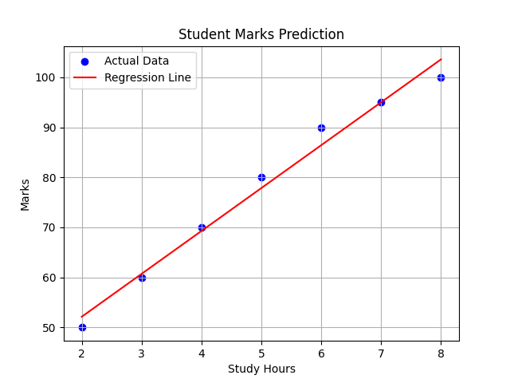

# 📊 Student Marks Prediction using Linear Regression

##  Overview
This project predicts student marks based on study hours using a manually implemented Linear Regression model.

---

##  Technologies Used
- Python
- Pandas
- NumPy
- Matplotlib

---

## Dataset
The dataset contains:
- Study Hours
- Marks Scored

---

## Approach
- Calculated mean values of X and Y
- Computed slope (m) and intercept (b)
- Built prediction function
- Visualized results using Matplotlib

---

## 📈 Output Graph


---

## 🔮 Example Prediction
Input:
Study Hours = 7

Output:
Predicted Marks ≈ 85

---

## ▶️ How to Run
```bash
pip install pandas numpy matplotlib
python main.py
